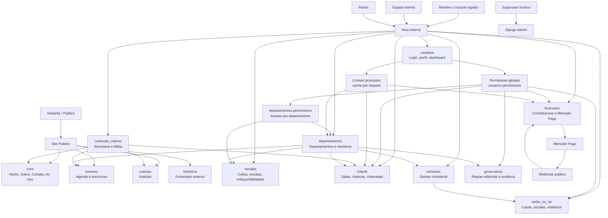
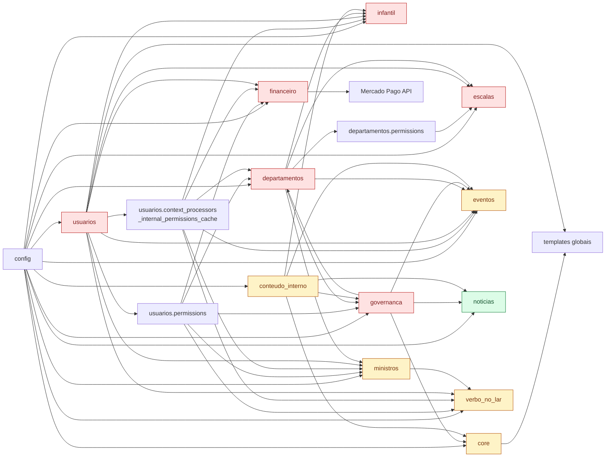
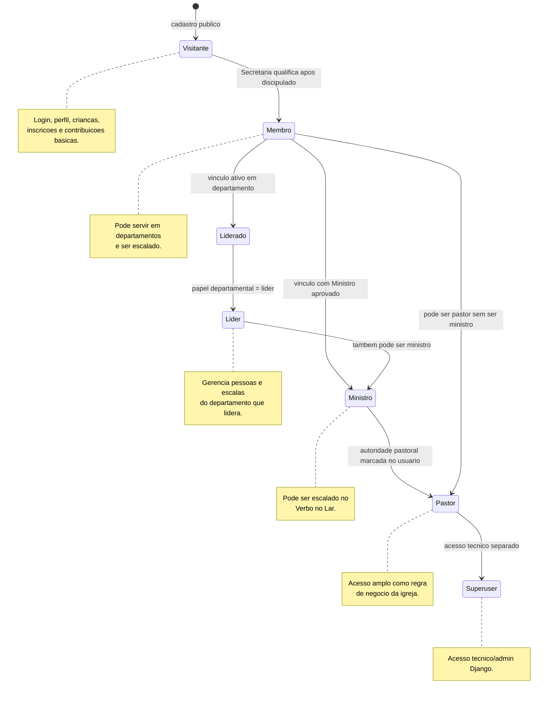
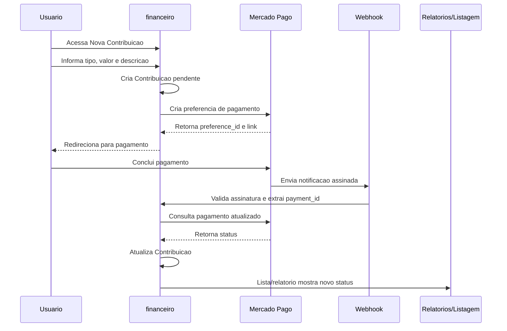

# Mapa Visual do Sistema - Portal Verbo JSP

Este documento complementa `ARQUITETURA.md`, `MAPA_DE_IMPACTO.md` e `FLUXOS.md` com diagramas Mermaid e uma leitura visual dos principais modulos, dependencias e riscos de impacto do sistema.

## Visao Macro do Sistema

## Dependencia entre Modulos

## Fluxo de Usuarios e Qualificacoes

## Fluxo de Dizimos e Ofertas

## Matriz de Impacto

| Modulo | Depende de | Impacta | Nivel de risco | Observacoes |
| --- | --- | --- | --- | --- |
| `usuarios` | Django auth, departamentos, ministros | Todos os apps internos | Alto | Dono de identidade, status, acesso pastoral/tecnico e permissoes transversais. |
| `usuarios.context_processors` | `departamentos`, `eventos`, `infantil`, `ministros`, `verbo_no_lar`, `financeiro` | Sidebar e templates internos | Medio/Alto | Usa cache por request para reduzir recomputacao, mas segue acoplado a muitos dominios. |
| `departamentos` | `usuarios` | Escalas, governanca, infantil, eventos, ministros | Alto | `DepartamentoMembro` define papeis e lideranca; `departamentos.permissions` centraliza gestao por departamento. |
| `governanca` | `core`, `departamentos`, `usuarios`, `eventos`, `noticias` | Secretaria, Midia, admin editorial | Alto | Regras editoriais usam funcoes de identidade/acesso ja separadas em `usuarios.permissions`. |
| `financeiro` | `usuarios`, `governanca`, Mercado Pago | Contribuicoes, relatorios financeiros, integracao externa | Alto | Lida com tokens, webhook publico e status financeiro. |
| `infantil` | `usuarios`, `departamentos`, `governanca` | Midia, responsaveis, dashboard interno | Alto | Dados sensiveis de criancas e fluxo operacional de chamadas. |
| `escalas` | `departamentos`, `usuarios` | Departamentos, dashboard, rotina de servico | Alto | Depende de papeis departamentais, conflitos e indisponibilidades. |
| `conteudo_interno` | `core`, `governanca`, `eventos`, `noticias`, `infantil` | Site publico, Secretaria, Midia | Medio/Alto | Painel administrativo funcional que altera dados de varios dominios. |
| `verbo_no_lar` | `usuarios`, `ministros`, `governanca` | Relatorios, escalas ministeriais, materiais | Medio/Alto | Depende de ministro e responsaveis de casas. |
| `ministros` | `usuarios`, `departamentos`, `governanca` | Verbo no Lar, qualificacao ministerial | Medio | Pode representar ministro externo ou usuario vinculado. |
| `eventos` | `usuarios`, `departamentos`, `governanca` | Agenda, inscricoes, check-in | Medio | QR/check-in e inscricoes publicas/logadas. |
| `core` | Poucas dependencias internas | Todo o site via `SiteConfig` | Medio | Context processor injeta configuracao global em todos os templates. |
| `noticias` | `conteudo_interno`, `governanca` para gestao | Site publico | Baixo/Medio | Dominio simples, mas participa da governanca editorial. |

## Modulos Criticos

### `usuarios`

Modulo mais estrutural do sistema. Define `AUTH_USER_MODEL`, login, dashboard, perfil e permissoes centrais de negocio. Qualquer alteracao em `Usuario` afeta FKs, migrations, forms, testes, templates e regras de acesso.

Cuidados:

- Evitar adicionar regras especificas de um modulo diretamente no model.
- Manter permissoes transversais em `usuarios.permissions`.
- Separar acesso tecnico (`is_superuser`) de papel de negocio; `is_staff` fica restrito ao admin tecnico Django.
- Manter diferenca entre identidade (`usuario_eh_*`) e acesso (`usuario_tem_acesso_*`).
- Testar perfis: visitante, membro, liderado, lider, ministro, pastor e superuser.

### `departamentos`

Base organizacional do sistema. O model `DepartamentoMembro` e a principal fonte de lideranca, participacao e papeis departamentais.

Cuidados:

- Mudancas em papeis impactam escalas, governanca, infantil e eventos.
- Lideranca deve vir de `DepartamentoMembro`, nunca de `is_staff`.
- Evitar imports legados de escalas dentro de departamentos no longo prazo.
- Tratar departamentos reservados como infraestrutura de permissao com cuidado.

### `governanca`

Centraliza regras editoriais e permissoes para Secretaria/Midia. Tem impacto direto na administracao de conteudo publico e em varios paineis internos.

Cuidados:

- Usar `usuario_eh_secretaria`/`usuario_eh_midia` apenas para identidade real.
- Usar `usuario_tem_acesso_secretaria`/`usuario_tem_acesso_midia` para autorizacao de telas e acoes.
- Manter auditoria clara para alteracoes sensiveis.

### `financeiro`

Modulo sensivel por lidar com contribuicoes, credenciais e integracao externa.

Cuidados:

- Nao expor access token no frontend.
- Proteger e auditar credenciais armazenadas.
- Registrar logs de webhook, pagamento nao encontrado e falhas de API.
- Diferenciar erros temporarios de erros permanentes no webhook.

### `infantil`

Modulo sensivel por lidar com criancas, responsaveis, salas, aulas e chamadas para Midia.

Cuidados:

- Manter acesso minimo necessario por responsavel, equipe, lider e midia.
- Auditar acoes operacionais em chamadas, se o uso crescer.
- Preservar separacao entre exibir chamada e resolver atendimento.

### `escalas`

Modulo operacional central para departamentos. Depende de `DepartamentoMembro`, indisponibilidades e regras de conflito.

Cuidados:

- Validar sempre departamento, vinculo ativo, conflito e indisponibilidade.
- Evitar duplicar regras em forms, models e services sem uma fonte clara.
- Garantir testes para lider de um departamento tentando agir em outro.

## Recomendacoes de Arquitetura

### Onde evitar acoplamento

- Evitar que `usuarios.context_processors.internal_permissions` continue crescendo indefinidamente com consultas a todos os apps. O cache por request ja reduz recomputacao, mas um servico de navegacao ainda pode isolar melhor esse acoplamento.
- Evitar que novas views usem funcoes de identidade como autorizacao. Pastor deve ter acesso pastoral, nao virar semanticamente Secretaria, Midia, Lider ou Ministro.
- Evitar que `departamentos` importe models de `escalas` como compatibilidade permanente.
- Evitar que regras de permissao fiquem duplicadas em views, forms e templates.
- Evitar que credenciais e segredos sejam tratados como campos administrativos comuns sem politica de seguranca.

### Quais apps devem continuar separados

- `usuarios`: identidade, qualificacao e permissoes transversais.
- `departamentos`: estrutura organizacional e papeis por departamento.
- `escalas`: regras de culto, escala, itens e indisponibilidade.
- `infantil`: dados e operacao infantil, por sensibilidade e regras proprias.
- `financeiro`: contribuicoes e integracao Mercado Pago.
- `verbo_no_lar`: casas, materiais, relatorios e escalas ministeriais.
- `ministros`: cadastro ministerial, inclusive externo.
- `conteudo_interno`: operacao de Secretaria/Midia sobre conteudo.
- `governanca`: regras editoriais e auditoria.

### Quais integracoes devem ir para services

- Mercado Pago: manter em `financeiro/services/mercado_pago.py`.
- Chamadas infantis para Midia: manter operacoes em `infantil/services/chamadas.py`.
- Cadastro/revisao infantil: manter em `infantil/services/cadastros.py`.
- Escalas e geracao mensal: manter em `escalas/services/`.
- Conteudo editorial: manter em `conteudo_interno/services/`.
- Futuras integracoes: WhatsApp, e-mail transacional, YouTube, relatorios exportaveis e BI devem entrar por services dedicados.

### Onde usar permissoes centralizadas

- `usuarios.permissions`: regras transversais de perfil de pessoa:
  - visitante;
  - membro;
  - secretaria/midia como identidade departamental reservada;
  - acesso secretaria/midia;
  - lider departamental;
  - ministro;
  - pastor;
  - superuser/acesso tecnico total;
  - acesso pastoral;
  - pode ser escalado.

- `departamentos.permissions`: regras especificas de departamento:
  - pertence ao departamento;
  - pode acessar departamentos;
  - pode gerenciar membros;
  - pode gerenciar escalas do departamento.

- `governanca.permissions`: regras editoriais e de paineis Secretaria/Midia.

- `infantil.permissions`: regras especificas de sala, equipe, crianca, aula e chamada.

- `verbo_no_lar.permissions`: regras especificas de casa, responsavel, anfitriao e administracao do modulo.

- `financeiro.permissions`: regras administrativas financeiras.

## Leitura recomendada do sistema

Para entender impacto antes de alterar qualquer parte:

1. Ler `usuarios/models.py` e `usuarios/permissions.py`.
2. Ler `departamentos/models.py` e `departamentos/permissions.py`.
3. Ler `governanca/permissions.py`.
4. Ler o app que sera alterado.
5. Revisar `usuarios/context_processors.py` para impacto na sidebar.
6. Revisar templates relacionados.
7. Rodar `python manage.py check`.
8. Rodar testes do app e dos apps dependentes.
